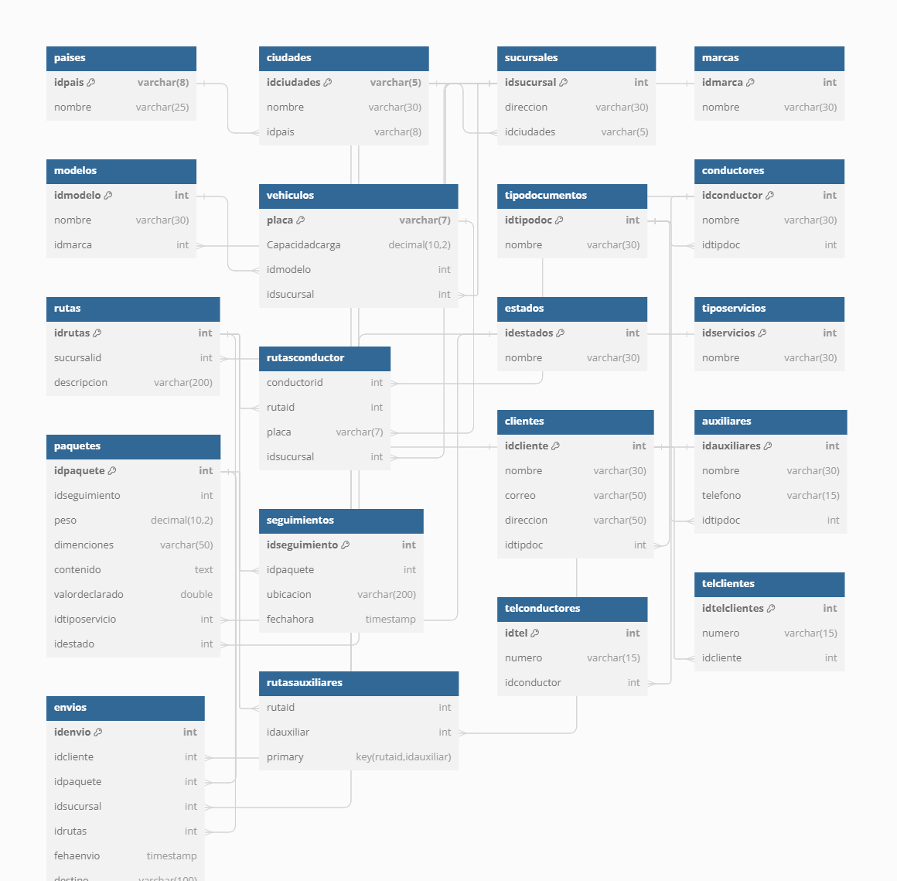

<h4>1.Un administrador desea agregar un nuevo país a la base de datos.</h4>

INSERT INTO paises (idpais, nombre) VALUES ('PA01', 'Colombia')

<h4>2.Un administrador desea agregar una nueva ciudad asociada a un país existente.</h4>
INSERT INTO ciudades (idciudades, nombre, idpais) VALUES ('C01', 'Bucaramanga', 'PA01')

<h4>3.Un administrador desea agregar una nueva sucursal asociada a una ciudad
existente.</h4>
INSERT INTO sucursales (direccion, idciudades) VALUES ('Direccion 1', 'C01')

<h4>4.Un administrador desea registrar un nuevo cliente en la base de datos.</h4>
INSERT INTO clientes (idcliente, nombre, correo, direccion, idtipdoc) VALUES (1, 'Cliente A', 'clienteA@example.com', 'Direccion Cliente A', 1)

<h4>5.Un administrador desea agregar un número de teléfono para un cliente existente.</h4>
INSERT INTO telclientes (numero, idcliente) VALUES ('555654321', 1)

<h4>6.Un administrador desea registrar un nuevo paquete en la base de datos.</h4>
INSERT INTO paquetes (idseguimiento, peso, dimenciones, contenido, valordeclarado, idtiposervicio, idestado) VALUES (1, 5.50, '10x10x10', 'Documento', 100.00, 1, 1)

<h4>7.Un administrador desea registrar un nuevo envío, asociando un cliente, paquete,
ruta y sucursal.</h4>
INSERT INTO envios (idcliente, idpaquete, idsucursal, idrutas, fehaenvio, destino) VALUES (1, 1, 1, 1, '2024-06-20 10:00:00', 'Destino A')

<h4>8.Un administrador desea agregar un nuevo vehículo a la base de datos.</h4>
INSERT INTO vehiculos (placa, Capacidadcarga, idmodelo, idsucursal) VALUES ('ABC123', 1000.50, 1, 1)

<h4>9.Un administrador desea agregar un nuevo conductor a la base de datos.</h4>
INSERT INTO conductores (idconductor, nombre, idtipdoc) VALUES (1, 'Conductor A', 1)

<h4>10.Un administrador desea agregar un número de teléfono para un conductor existente.</h4>
INSERT INTO telconductores (numero, idconductor) VALUES ('555123456', 1)

<h4>11.Un administrador desea asignar un conductor a una ruta específica utilizando un vehículo.</h4>
INSERT INTO rutasconductor (conductorid, rutaid, placa, idsucursal) VALUES (1, 1, 'ABC123', 1)

<h4>12.Un administrador desea agregar un nuevo auxiliar de reparto a la base de datos.</h4>
INSERT INTO auxiliares (idauxiliares, nombre, telefono, idtipdoc) VALUES (1, 'Auxiliar A', '555123456', 1)

<h4>13.Un administrador desea asignar un auxiliar de reparto a una ruta específica.</h4>
INSERT INTO rutasauxiliares (rutaid, idauxiliar) VALUES 
(1, 1)

<h4>14.Un administrador desea registrar un evento de seguimiento para un paquete.</h4>
INSERT INTO seguimientos (idpaquete, ubicacion, fechahora) VALUES (1, 'Ubicación 1', '2024-06-20 10:00:00')

<h4>15.Un administrador desea generar un reporte de todos los envíos realizados por un cliente específico.</h4>
SELECT 
    e.idenvio,
    e.fehaenvio,
    e.destino,
    p.contenido AS paquete_contenido,
    p.peso AS paquete_peso,
    s.direccion AS sucursal_direccion,
    r.descripcion AS ruta_descripcion
FROM 
    envios e
JOIN 
    paquetes p ON e.idpaquete = p.idpaquete
JOIN 
    sucursales s ON e.idsucursal = s.idsucursal
JOIN 
    rutas r ON e.idrutas = r.idrutas
WHERE 
    e.idcliente = 3;

<h4>16.Un administrador desea actualizar el estado de un paquete específico.</h4>
UPDATE paquetes SET idestado = 2 WHERE idpaquete = 2;

<h4>17.Un administrador desea rastrear la ubicación actual de un paquete específico.</h4>
SELECT 
    idseguimiento,
    idpaquete,
    ubicacion,
    fechahora
FROM 
    seguimientos
WHERE 
    idpaquete = 2
ORDER BY 
    fechahora DESC;

<h4>Casos Multitabla</h4>

<h4>1.Un administrador desea obtener la información completa de todos los envíos,
incluyendo detalles del cliente, paquete, ruta, conductor, y sucursal.</h4>

SELECT envios.idenvio, clientes.nombre AS cliente, paquetes.idpaquete, paquetes.contenido AS contenido_paquete, 
       seguimientos.ubicacion AS ubicacion_actual, estados.nombre AS estado_actual
FROM envios
JOIN clientes ON envios.idcliente = clientes.idcliente
JOIN paquetes ON envios.idpaquete = paquetes.idpaquete
JOIN seguimientos ON paquetes.idpaquete = seguimientos.idpaquete
JOIN estados ON paquetes.idestado = estados.idestados;

<h4>2.Un administrador desea obtener el historial completo de envíos de un cliente
específico, incluyendo detalles de los paquetes y los eventos de seguimiento.</h4>

SELECT envios.idenvio, paquetes.idpaquete, paquetes.contenido AS contenido_paquete, 
       seguimientos.ubicacion AS ubicacion_actual, seguimientos.fechahora AS fecha_hora_seguimiento
FROM envios
JOIN paquetes ON envios.idpaquete = paquetes.idpaquete
JOIN seguimientos ON paquetes.idpaquete = seguimientos.idpaquete
WHERE envios.idcliente = 1;

<h4>3.Un administrador desea obtener una lista de todos los conductores y las rutas a las
que están asignados, incluyendo detalles del vehículo utilizado y la sucursal correspondiente.</h4>

SELECT conductores.nombre AS nombre_conductor, vehiculos.placa AS placa_vehiculo, 
       rutas.descripcion AS descripcion_ruta, sucursales.direccion AS direccion_sucursal
FROM conductores
JOIN rutasconductor ON conductores.idconductor = rutasconductor.conductorid
JOIN vehiculos ON rutasconductor.placa = vehiculos.placa
JOIN rutas ON rutasconductor.rutaid = rutas.idrutas
JOIN sucursales ON rutas.sucursalid = sucursales.idsucursal;

<h4>4.Un administrador desea obtener detalles de todas las rutas, incluyendo los auxiliares asignados a cada ruta.</h4>

SELECT rutas.idrutas, rutas.descripcion AS descripcion_ruta, auxiliares.nombre AS nombre_auxiliar
FROM rutas
JOIN rutasauxiliares ON rutas.idrutas = rutasauxiliares.rutaid
JOIN auxiliares ON rutasauxiliares.idauxiliar = auxiliares.idauxiliares;

<h4>5.Un administrador desea generar un reporte de todos los paquetes agrupados por sucursal y estado.</h4>

SELECT 
    sucursales.direccion AS direccion_sucursal, 
    estados.nombre AS estado_paquete,
    paquetes.idpaquete,
    paquetes.peso,
    paquetes.dimenciones,
    paquetes.contenido,
    paquetes.valordeclarado
FROM 
    envios
JOIN 
    sucursales ON envios.idsucursal = sucursales.idsucursal
JOIN 
    paquetes ON envios.idpaquete = paquetes.idpaquete
JOIN 
    estados ON paquetes.idestado = estados.idestados
ORDER BY 
    sucursales.direccion, estados.nombre;

<h4>6.Un administrador desea obtener la información completa de un paquete específico y su historial de seguimiento.</h4>

SELECT paquetes.idpaquete, paquetes.contenido AS contenido_paquete, seguimientos.ubicacion AS ubicacion_actual, seguimientos.fechahora AS fecha_hora_seguimiento
FROM paquetes
JOIN seguimientos ON paquetes.idpaquete = seguimientos.idpaquete
WHERE paquetes.idpaquete = 1; 

<h4>Casos de uso  Not In</h4>

<h4>1.Un administrador desea obtener todos los paquetes que fueron enviados dentro de un rango de fechas específico.</h4>

SELECT 
    idenvio,
    idcliente,
    idpaquete,
    idsucursal,
    idrutas,
    fehaenvio,
    destino
FROM 
    envios
WHERE 
    fehaenvio BETWEEN '2024-06-20 00:00:00' AND '2024-06-23 23:59:59';

<h4>2.Un administrador desea obtener todos los paquetes que tienen ciertos estados
específicos (por ejemplo, 'en tránsito' o 'entregado').</h4>

SELECT 
    idpaquete,
    idseguimiento,
    peso,
    dimenciones,
    contenido,
    valordeclarado,
    idtiposervicio,
    idestado
FROM 
    paquetes
WHERE 
    idestado IN (1, 2);

<h4>3.Un administrador desea obtener todos los paquetes excluyendo aquellos que tienen
ciertos estados específicos (por ejemplo, 'recibido' o 'retenido en aduana').</h4>

SELECT 
    idpaquete,
    idseguimiento,
    peso,
    dimenciones,
    contenido,
    valordeclarado,
    idtiposervicio,
    idestado
FROM 
    paquetes
WHERE 
    idestado NOT IN (3, 4);

<h4>4.Un administrador desea obtener todos los clientes que realizaron envíos dentro de
un rango de fechas específico.</h4>

SELECT DISTINCT 
    clientes.idcliente,
    clientes.nombre,
    clientes.correo,
    clientes.direccion,
    clientes.idtipdoc
FROM 
    clientes
JOIN 
    envios ON clientes.idcliente = envios.idcliente
WHERE 
    envios.fehaenvio BETWEEN '2024-06-20 00:00:00' AND '2024-06-24 13:59:59';

<h4>5.Un administrador desea obtener todos los conductores que no están asignados a
ciertas rutas específicas.</h4> 

SELECT DISTINCT 
    conductores.idconductor,
    conductores.nombre,
    conductores.idtipdoc
FROM 
    conductores
LEFT JOIN 
    rutasconductor ON conductores.idconductor = rutasconductor.conductorid
WHERE 
    rutasconductor.rutaid NOT IN (1, 3);

<h4>6.Un administrador desea obtener todos los paquetes cuyo valor declarado está dentro de un rango específico.</h4>

SELECT 
    idpaquete,
    idseguimiento,
    peso,
    dimenciones,
    contenido,
    valordeclarado,
    idtiposervicio,
    idestado
FROM 
    paquetes
WHERE 
    valordeclarado BETWEEN 200.00 AND 400.00;

<h4>7.Un administrador desea obtener todos los auxiliares de reparto que están asignados a ciertas rutas específicas.</h4>

SELECT
    auxiliares.idauxiliares,
    auxiliares.nombre,
    auxiliares.telefono,
    auxiliares.idtipdoc
FROM 
    auxiliares
JOIN 
    rutasauxiliares ON auxiliares.idauxiliares = rutasauxiliares.idauxiliar
WHERE 
    rutasauxiliares.rutaid IN (1, 2);

<h4>8.Un administrador desea obtener todos los envíos cuyos destinos no están en ciertas
ciudades específicas.</h4>

SELECT 
    envios.idenvio,
    envios.idcliente,
    envios.idpaquete,
    envios.idsucursal,
    envios.idrutas,
    envios.fehaenvio,
    envios.destino
FROM 
    envios
JOIN 
    sucursales ON envios.idsucursal = sucursales.idsucursal
JOIN 
    ciudades ON sucursales.idciudades = ciudades.idciudades
WHERE 
    ciudades.nombre NOT IN ('Monterrey', 'Barcelona');

<h4>9.Un administrador desea obtener todos los eventos</h4>

SELECT 
    idseguimiento,
    idpaquete,
    ubicacion,
    fechahora
FROM 
    seguimientos
WHERE 
    fechahora BETWEEN '2024-06-20 00:00:00' AND '2024-06-24 23:59:59';

<h4>10.Un administrador desea obtener todos los clientes que tienen paquetes de ciertos tipos específicos (por ejemplo, 'nacional' o 'internacional').</h4>

SELECT DISTINCT 
    clientes.idcliente,
    clientes.nombre,
    clientes.correo,
    clientes.direccion,
    clientes.idtipdoc
FROM 
    clientes
JOIN 
    envios ON clientes.idcliente = envios.idcliente
JOIN 
    paquetes ON envios.idpaquete = paquetes.idpaquete
JOIN 
    tiposervicios ON paquetes.idtiposervicio = tiposervicios.idservicios
WHERE 
    tiposervicios.nombre IN ('Express', 'Economy');

